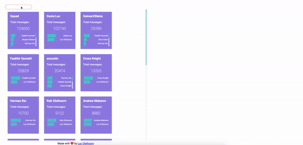

## Facebook Messenger Viz

Visualize your messenger data from Facebook!

Takes in the dump facebook gives you into a viz!

## Run

Runs on node 14+ if you don't have that version of node, I highly recommend upgrading, or using n to manage multiple versions

1. Download Facebook Data: Go to https://www.facebook.com/dyi/
2. Select: DateRange: All time, Format: JSON, Media Quality: High
3. Select the Deselect all button
4. Click only on messages
5. Hit the Create File button
6. Wait a day or two
7. Return to https://www.facebook.com/dyi/ and download
8. Unzip the file: It will be a single zip with two zips inside of it.
9. Unzip the second zip (doesn't have photos in the photos folder)
10. Clone this repo
11. Move that folder to `./server/inputData` so that it rests at `/server/inputData/messages` (you might have to create the inputData folder)
12. `npm install` and `npm run start` in the server folder
13. `npm install` and `npm run start` in the frontend
14. It will probably ask you to use port 3001, which is chill
15. Go to `localhost:3001`
16. Enjoy
